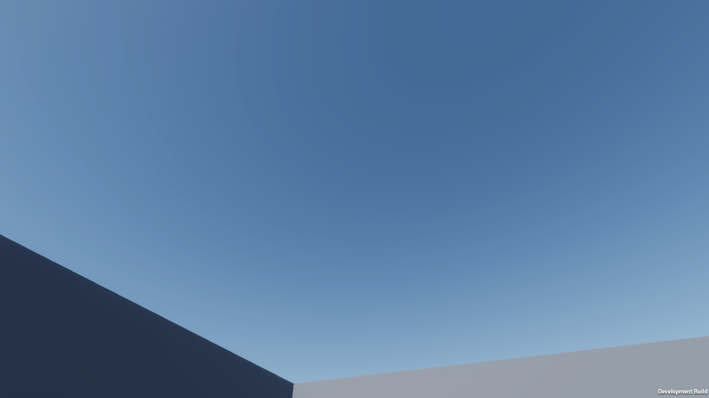

# Seamless Portals for HDRP

[](https://unity.com/releases/editor/archive)

[](LICENSE)

Walk-through portals for Unity 6 and HDRP. The view inside the opening lives under
the same exposure, tonemapping and antialiasing as the rest of the frame, so the
frame before you cross and the frame after are the same picture.



## Requirements

- Unity **6000.5.9f1** (developed and measured on this version)
- **High Definition Render Pipeline 17.5.0**
- Linear color space, DX12 or Vulkan
- Cinemachine 3.x — optional. The module compiles and runs without it.

A note before you read further: **the source comments are in Russian.** The public
API names are English and this page is English, but if you plan to read the
internals, that is what you are getting.

## Installation

There is no UPM package yet. Two ways to get the code:

**Clone the whole project.** It is a working Unity project with a sandbox scene
and the test lab, which is the fastest way to see the thing running:

```
git clone https://github.com/me0wbear/unity-hdrp-portals.git
```

Open it in Unity 6000.5.9f1, then open `Assets/portal/Examples/PortalSandbox.unity`
and press Play.

**Copy the module into an existing project.** Copy the `Assets/portal` folder
across. Everything the module needs is inside it: code, shaders, materials,
prefabs. No project settings need changing.

If the material ends up unassigned after the copy, rebuild it from
**Tools → Portals → Rebuild Module Assets**.

## Quick start

1. Drag `Assets/portal/PortalPair.prefab` into your scene. Both ends are already
   linked to each other.
2. Move each end where you want it. Grab the `Portal_A` and `Portal_B` children
   separately, not the parent.
3. Run **Tools → Portals → Wire Scene**. It hands your camera to every portal in
   the scene — the one thing a prefab cannot carry, because the reference lives
   in the scene.
4. Add a `PortalTraveller` component to your player root, and put the camera
   transform in its **View Point** field.
5. Press Play and walk through.

No player yet? Drag in `Assets/portal/PortalPlayer.prefab` instead of step 4 —
character controller, traveller, camera bridge and camera, already wired. Its
movement script is a demo, meant to be swapped for yours.

Check your work with **Tools → Portals → Validate Scene**. It reports what each
portal is missing, if anything.

## What the components do

| Component | Goes on | Job |
| --- | --- | --- |
| `Portal` | The opening | Holds the link to the other end, the quad and the quality settings |
| `PortalTraveller` | Anything that goes through | Detects the crossing, teleports, draws the clone on the far side |
| `PortalCameraBridge` | The player root | Keeps the view continuous across the cut: Cinemachine state, HDRP frame history, saved look angle |
| `PortalBudget` | Anywhere, one per scene | Caps how many recursion levels the whole scene may draw at once |

The `Portal` inspector fields worth knowing:

- **Recursion Depth** — how many times a portal is seen inside itself. `0` means
  no recursion. Each level costs one camera and one screen-sized target.
- **Resolution Divider** — `1` renders the view at screen resolution, pixel for
  pixel. Raise it to trade sharpness for frame time.
- **Write Content Depth** — writes the real distance to what is visible through
  the opening into the camera depth buffer, so fog, depth of field and ambient
  occlusion work off that distance instead of the distance to the quad.
- **Blend Volumes Through Portal** — carries the destination side's volume state
  across as you approach, so two rooms with different grading do not snap at the
  moment you cross.

## How it works

A virtual camera per recursion level renders into a screen-sized target. The
quad samples that target by **screen-space UV**, not by its own UV map, so the
pixel of the opening takes exactly the pixel the virtual camera drew for that
place on screen.

The virtual camera renders with exposure control switched off, which yields
absolute radiance. The quad puts the result into `emissiveColor`, which HDRP
multiplies by the main camera's exposure. That is what keeps the opening under
the same exposure, tonemap, bloom and antialiasing as everything around it,
rather than compositing a second, independently graded image on top.

The near plane of each virtual camera is skewed to the exit portal's plane, so
geometry behind the exit never enters the view.

Near the opening the quad is pushed back along the portal normal so it never
falls behind the near clip plane. It cannot show a gap in the last centimetres,
which is where a naive portal breaks.

The crossing itself is detected by distance to the portal plane, not by trigger
events. Triggers go silent while a `CharacterController` is disabled, which is
exactly what many controllers do during a teleport.

## What is verified

The repository carries a test lab under `Assets/LabTools` — 34 unit tests plus
scene checks that build a player, walk a scripted path and measure the frames.
Numbers below are from an RTX 5080 at 1280x720.

| Check | Measures | Result |
| --- | --- | --- |
| Colour | Frame before the crossing against frame after | delta **0.0003** |
| Cross | Camera step across the crossing frame | **0.0500**, the nominal walking step |
| Rotate | Pixels of the far room leaking around the opening, 5 distances x 11 angles | **0** |
| Bubble | Image sharpness as the opening is approached | no collapse: 0.0089, 0.0080, 0.0046, 0.0046, 0.0038 |
| Ghost | Portal view against the same view rendered directly | within 0.0008 with TAA on |

Run one with `tools/check.sh <name>`, for example `tools/check.sh Color`.

Known state: the **Seam** check does not build right now, failing with
`level0 is corrupted` during scene serialization. It fails identically on
unmodified code, so it is an environment problem rather than a regression.

## Limitations

Read this section. It is the honest list.

- **The opening must be a real hole in the geometry.** A portal laid over a solid
  wall will show the inside of that wall from close up.
- **Two portals facing each other overwrite each other's view.** Each chain
  writes its target onto the other's quad, and one of them ends up blank. Place
  a facing pair at an angle for now.
- **Motion vectors inside the opening belong to the quad, not to what is seen
  through it.** Fast camera movement leaves a faint trail on the content. Taking
  the real vectors from the virtual camera was tried and reverted: what it
  returns is non-zero on a completely static scene, and temporal antialiasing
  then resolves the frame along a movement that never happened, which blurs the
  whole opening.
- **Depth of field over-blurs the opening in the last centimetres before the
  crossing.** At a distance the substituted depth is correct and the blur follows
  it. If it bothers you, start the near blur range beyond the portal.
- **Clone slicing needs a material that supports it.** The module sets
  `_SliceCentre`, `_SliceNormal` and `_SliceEnabled` on every renderer of a
  traveller; a material that ignores them will not slice. No ready-made sliced
  material ships with the module.
- **Skinned animation is not carried to the clone.**
- **Collisions are not split by side during the crossing.** A traveller can catch
  on geometry around the exit.
- **Stereo rendering is not supported.**
- **Sound does not pass through a portal.**
- The UHFPS bridge is written against reflection and tested against stubs that
  copy the real class names and signatures. It has not been confirmed on the
  actual asset.

## License

MIT — see [LICENSE](LICENSE).
